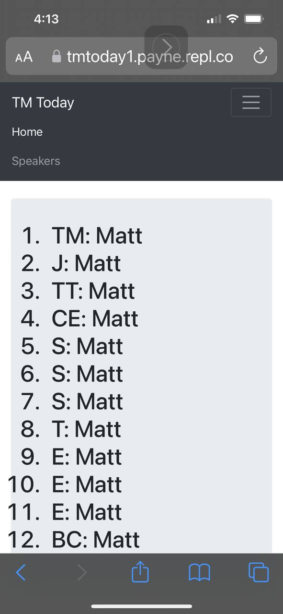

Playing with a utility for who's doing what at a toastmasters meeting.  

### live URL: https://payne.github.io/TMtoday1/index.html

## Ideas:

### TODOs:
1. Click on a name and see upcoming duties
1. Idea from John F -- a button or menu item to show who does not have a duty today
1. Automatically pull up the next toastmaster day
1. Previous & next meeting links
1. Idea -- How to track fill in folks

### Done:
1. Menu item to show everyone who has a duty
1. Menu item showing just speakers & evaluators
1. Drop down list for choosing the day (defaults to today or next upcoming meeting)
1. Menu item linking to github source code
1. Menu item to display a QR Code that links to the online web page

Here's a screen grab of the first baby step:

This project uses [my favorite chunk of bootstrap boilerplate](https://raw.githubusercontent.com/fontenele/bootstrap-navbar-dropdowns/master/example-bs4.html).
Many thanks [Guilherme Fontenele](https://github.com/fontenele/bootstrap-navbar-dropdowns)!!

